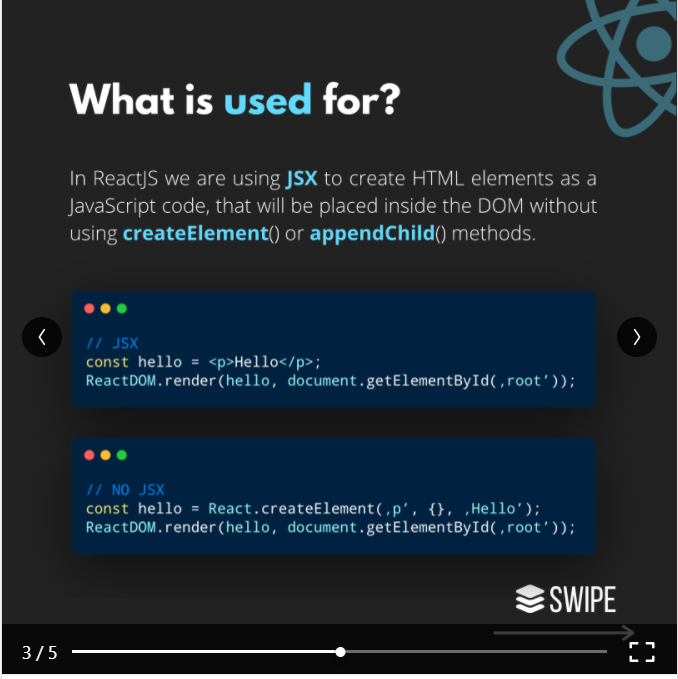

# Readings: Introduction to React and Components


## Component Based Architecture :

A component is a set of code that have it's own methods and properties and that can be reused and exported with other applications.


Characteristics of Components :

* Reusability  
* Replaceable 
* Not context specific
* Extensible  
* Encapsulated 
* Independent 

The advantages of using component based architecture :

* Ease of deployment
* Reduced cost
* Ease of development
* Reusable
* Modification of technical complexity
* Reliability
* System maintenance and evolution
* Independent 

## What is a React Component?

**A component is an independent, reusable code block, which divides the UI into smaller pieces.** In other words, we can think of components as LEGO blocks. Likewise we create a LEGO structure from many little LEGO blocks, we create a webpage or UI from many little code blocks (components).

```We don’t really want to have thousands of lines of code together in one single file. Maintenance of the code gets more and more complex as the project gets bigger.```

```In this point, dividing the source code into components helps us a lot. Each component has its own JS and CSS code, they are reusable, easier to read, write and test.```

* React has 2 types of components: **Functional (Stateless) and Class (Stateful).**


------------------

## What is Props and How to Use it in React

In some cases,components need to communicate (send data to each other) and the way to pass data between components is by using **props.**

**“Props”** is a special keyword in React, which stands for **properties** and is being used for **passing data from one component to another.**


But the important part here is that data with props are being passed in a **uni-directional flow.** (one way from parent to child)

Furthermore, **props data is read-only,** which means that data coming from the parent **should not** be changed by child components.


## Article - React Tutorial through 'Passing Data Through Props

React is a declarative, efficient, and flexible JavaScript library for building user interfaces. It lets you compose complex UIs from small and isolated pieces of code called “components”.

```js

class ShoppingList extends React.Component {
  render() {
    return (
      <div className="shopping-list">
        <h1>Shopping List for {this.props.name}</h1>
        <ul>
          <li>Instagram</li>
          <li>WhatsApp</li>
          <li>Oculus</li>
        </ul>
      </div>
    );
  }
}

// Example usage: <ShoppingList name="Mark" />
```

Here, ShoppingList is a **React component class**, or **React component type.** A component takes in parameters, called props (short for “properties”), and returns a hierarchy of views to display via the render method.

* **JSX** a special syntax used to write render structures.


## Article - Introducing JSX - React

**is a syntax extension to javascript used in ReactJS that allows writing javascript that looks similar to HTML**

* JSX is a syntax extension to JavaScript.
* JSX produces React "elements".
* JSX isn't required but it is helpful when needing a visual aid when working with UI inside of JavaScript code.
* JSX allows React to show more useful error and warning messages.

```## Things I want to know more about```

