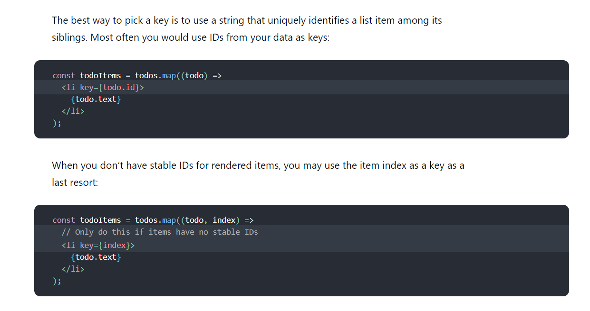

# Readings: Passing Functions as Props

## React Docs - lists and keys


1. What does .map() return? **.map() renders a list of data.**

2. If I want to loop through an array and display each value in JSX, how do I do that in React? **by using the map() while creating an array of objects.**

3. Each list item needs a unique **Key** .

4. What is the purpose of a key? **a key is a string attribite you need in order to create a list of elements. It helps react identify what items have changed, added , or removed.**



## The Spread Operator

1. What is the spread operator? **The spread operator is a quick useful syntax to modify your array. You can add items to your arrays, combine arrays or objects, and spread out an array into function arguments.**

2. List 4 things that the spread operator can do.

* copy an array

*  concatenate or combine arrays

* add items to lists

* using math functions

3. Give an example of using the spread operator to combine two arrays.

```js
const myArray = [`🤪`,`🐻`,`🎌`]
const yourArray = [`🙂`,`🤗`,`🤩`]
const ourArray = [...myArray,...yourArray]
```
4. Give an example of using the spread operator to add a new item to an array.


```js
  const ocean = ['🐙', '🦀'];
  const fish = ['🐠', '🐟'];

  const aquarium = [...ocean, ...fish];
```

5.Give an example of using the spread operator to combine two objects into one.


```js
let person = {
    firstName: 'John',
    lastName: 'Doe',
    age: 25,
    ssn: '123-456-2356'
};


let job = {
    jobTitle: 'JavaScript Developer',
    location: 'USA'
};

let employee = {
    ...person,
    ...job
};

console.log(employee);
```


## How to Pass Functions Between Components

1. In the video, what is the first step that the developer does to pass fucntions between components?**in the video use the array map method by creating a function where the state he is going to change then passes an object through it.**

2. In your own words, what does the increment function do? **the incremement function will basically increment by one and then return the value.**

3. How can you pass a method from a parent component into a child component? **You can pass the parent as a prop to the child componenet**

4. How does the child component invoke a method that was passed to it from a parent component? **by using this.props**

## Things I want to know more abou


