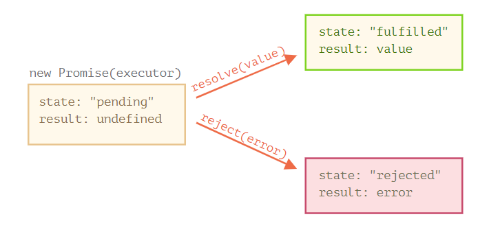

# Notes :

## Classes : 

Classes are in fact "special functions", and just as you can define function expressions and function declarations, the class syntax has two components: class expressions and class declarations.

One way to define a class is using a class declaration. To declare a class, you use the class keyword with the name of the class ("Rectangle" here).

```js
class Rectangle {
  constructor(height, width) {
    this.height = height;
    this.width = width;
  }
}
```
[https://developer.mozilla.org/en-US/docs/Web/JavaScript/Reference/Classes]()

------------------------------------------------------------
------------------------------------------------------------

### Hoisting

An important difference between function declarations and class declarations is that function declarations are hoisted and class declarations are not. You first need to declare your class and then access it, otherwise code like the following will throw a ReferenceError.

[https://developer.mozilla.org/en-US/docs/Glossary/Hoisting]()
[https://www.w3schools.com/js/js_hoisting.asp]()


------------------------------------------------------------
------------------------------------------------------------

## JavaScript Callbacks :

**A callback is a function passed as an argument to another function.**

[https://www.w3schools.com/js/js_callback.asp]()


## JavaScript Promises :
A JavaScript Promise object contains both the producing code and calls to the consuming code :

```js
let myPromise = new Promise(function(myResolve, myReject) {
// "Producing Code" (May take some time)

  myResolve(); // when successful
  myReject();  // when error
});

// "Consuming Code" (Must wait for a fulfilled Promise)
myPromise.then(
  function(value) { /* code if successful */ },
  function(error) { /* code if some error */ }
);
```

------------------------------------------------------------
------------------------------------------------------------

### Promise Object Properties
A JavaScript Promise object can be:

* Pending
* Fulfilled
* Rejected

The Promise object supports two properties: state and result.

* While a Promise object is "pending" (working), the result is undefined.

* When a Promise object is "fulfilled", the result is a value.

* When a Promise object is "rejected", the result is an error object.


Here is how to use a Promise:

```js
myPromise.then(
  function(value) { /* code if successful */ },
  function(error) { /* code if some error */ }
);
```

Promise.then() takes two arguments, a callback for success and another for failure.

Both are optional, so you can add a callback for success or failure only.



**Consumers: then, catch, finally**

A Promise object serves as a link between the executor (the “producing code” or “singer”) and the consuming functions (the “fans”), which will receive the result or error. Consuming functions can be registered (subscribed) using methods .then, .catch and .finally.

^^^^^^^^^^ See it in thin link ^^^^^^^^^^
[https://javascript.info/promise-basics]()


------------------------------------------------------------
------------------------------------------------------------

## Async Await

The keyword ``async`` before a function makes the function return a promise.

The keyword ``await`` before a function makes the function wait for a promise.

The ``await`` keyword can only be used inside an ``async`` function.


[https://javascript.info/async-await]()


------------------------------------------------------------
------------------------------------------------------------

state take some time to refelcet changes on them when you change them >>

```js
  constructor(props) {
    super(props);
    this.state = {
      HornedData: HornedData,
      show: false,
      SelectedBeast: '',
      HornsNumber: 'All', // deafult value
    }
  }

```

```js
  selectNumOfHorn = (event) => {
    console.log(this.state.HornsNumber) //before setState
    this.setState({
      HornsNumber: event.target.value
    });
    console.log(this.state.HornsNumber) // after setState
  }
```  

when I run the form (if I choose number of horns = 3 ) :

will give me the value before setState & after setState equal :


------------------------------------------------------------
------------------------------------------------------------

# REST

REST: Representational State Transfer

* However, most common REST API implementations use HTTP as the application protocol, and this guide focuses on designing REST APIs for HTTP.

* What are the most common HTTP verbs?

GET, POST, PUT, PATCH, and DELETE

* What status code does a successful GET request return?

200

* What status code does an unsuccessful GET request return?

404

* What status code does a successful POST request return?

201

* What status code does a successful DELETE request return?

204


* HTTP response status codes:

https://developer.mozilla.org/en-US/docs/Web/HTTP/Status