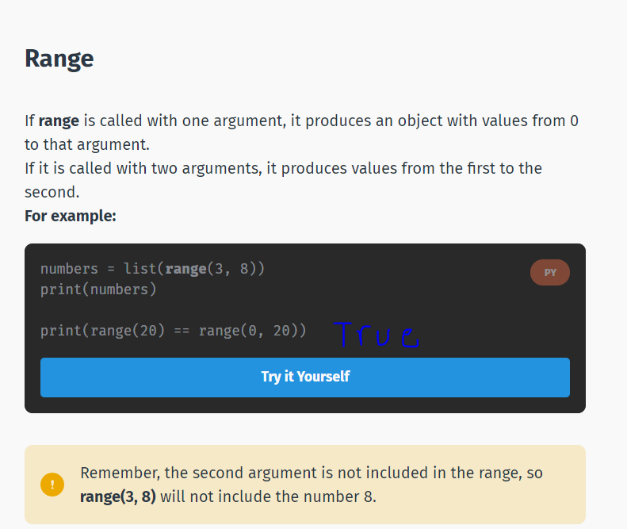

# Python

* dividing any two integers produces a **float**.

* exponentiation : he raising of one number to the power of another. This operation is performed using two asterisks.

```py
print(2**5)
```

* Quotient


```py
print(20//6)
```

The code above will output 3, because 6 goes into 20 three times.

* Remainder

The modulo operator(%) is carried out with a percent symbol (%) and is used to get the remainder of a division.

```py
print(20%6)
```
The code above will output 2

-------------------------------------------------------

## Strings
If you want to use text in Python, you have to use a string.
A string is created by entering text between two single or double quotation marks.

* String Operations:

Strings can also be multiplied by integers. This produces a repeated version of the original string. The order of the string and the integer doesn't matter, but the string usually comes first.

```py
print('one' * 3)

The code above will output: oneoneone

```


## input

-To get input from the user in Python, you can use the intuitively named input function.

-input() function returns a string.

```py
x = input()
print(x)
```

* The input statement needs to be followed by parentheses.
You can provide a string to input() between the parentheses, producing a prompt message.

```py
x = input('enter your name')
print(x)
```

* Let's assume we want to take the age of the user as input.
We know that the input() function returns a string.
To convert it to a number, we can use the int() function.

```py
x = “2”
y = “4”
z = int(x) + int(y)
print(z)
6
```

* Similarly, in order to convert a number to a string, the str() function is used. This can be useful if you need to use a number in string concatenation.

## Walrus operator


## Booleans

* Another type in Python is the Boolean type. There are two Boolean values: True and False.
They can be created by comparing values, for instance by using the equal operator ==

* Be careful not to confuse **assignment** (one equals sign) with **comparison** (two equals signs).

* Comparison operators are also called **Relational operators**.

## if Statements

```py
if expression:
   statements
```
**Notice the colon after the if keyword.**

* Python uses **indentation** (white space at the beginning of a line) to delimit blocks of code. Depending on program's logic, indentation can be mandatory. As you can see, the statements in the **if** should be indented.


```py
spam = 7
if spam > 5:
   print("five")
if spam > 8:
   print("eight")
```

* To perform more complex checks, if statements can be **nested**, one inside the other.
This means that the inner if statement is the statement part of the outer one. This is one way to see whether multiple conditions are satisfied.

```py
num = 7
if num > 3:
   print("3")
   if num < 5:
      print("5")
      if num ==7:
         print("7")
```

## else Statements


* The if statement allows you to check a condition and run some statements, if the condition is True.
The else statement can be used to run some statements when the condition of the if statement is False.

* As with if statements, the code inside the block should be indented.

**Notice the colon after the else keyword.**


## elif Statements


* The elif statement is equivalent to an else/if statement. It is used to make the code shorter, more readable, and avoid indentation increase.


# List


* In some code samples you might see a comma after the last item in the list. It's not mandatory, but perfectly valid.

```
How many items are in this list?

[2,]

the answer is : 1
```


```py
What is the result of this code?

nums = [10, 9, 8, 7, 6, 5]
nums[0] = nums[1] - 5
if 4 in nums:
  print(nums[3])
else:
  print(nums[4])

  the output is : 7
  ```


* The **append** method adds an item to the end of an existing list.

* The dot before append is there because it is a method of the list class

```py
What is the result of this code?

words = ["hello"]
words.append("world")
print(words[1])

the output is : world
```

* To get the number of items in a list, you can use the len function.

* len is written before the list it is being called on, without a dot.

```py
What is the result of this code?

letters = ["a", "b", "c"]
letters.append("d")
print(len(letters))

the output is : 4
```
* 
The **insert** method is similar to append, except that it allows you to insert a new item at any position in the list, as opposed to just at the end.

* Elements, that are after the inserted item, are shifted to the right.


```py
What is the result of this code?

nums = [9, 8, 7, 6, 5]
nums.append(4)
nums.insert(2, 11) // first parameter the number of index
print(len(nums))

```

* The **index** method finds the first occurrence of a list item and returns its index.
* If the item isn't in the list, it raises a ValueError.

* There are a few more useful functions and methods for lists.
* max(list): Returns the list item with the maximum value
* min(list): Returns the list item with minimum value
* list.count(item): Returns a count of how many times an item occurs in a list
* list.remove(item): Removes an object from a list
* list.reverse(): Reverses items in a list.

# while Loops

A while loop is used to repeat a block of code multiple times.
For example, let's say we need to process multiple user inputs, so that each time the user inputs something, the same block of code needs to execute.

```py
How many numbers does this code print?

i = 3
while i>=0:
   print(i)
   i = i - 1

the code will run 4 times
```  
## break

To end a while loop prematurely, the break statement can be used.
For example, we can break an infinite loop if some condition is met.
* Using the break statement outside of a loop causes an error.


```py
How many numbers does this code print?

i = 5
while True:
  print(i)
  i = i - 1
  if i <= 2:
    break

the output is :3
```

## continue

Another statement that can be used within loops is continue.
Unlike break, continue jumps back to the top of the loop, rather than stopping it. Basically, the continue statement stops the current iteration and continues with the next one.
* Using the continue statement outside of a loop causes an error.


* Similar to while loops, the break and continue statements can be used in for loops, to stop the loop or jump to the next iteration.





-------------------------------------------


* You must define functions before they are called, in the same way that you must assign variables before using them.

```py
def max(x,y):

  if x>=y:
    return x

  else :
    return y
print (max(400,70))
z= max(8,5)
print (z)
```

* Once you return a value from a function, it immediately stops being executed. Any code(inside the function) after the return statement will never happen.
For example:


* Functions can also be used as arguments of other functions.(leasson 36.1)


* Trying to import a module that isn't available causes an ImportError.


* What is an exception?

An event that occurs due to incorrect code or input

Different exceptions are raised for different reasons.

Common exceptions:

ImportError: an import fails;

IndexError: a list is indexed with an out-of-range number;

NameError: an unknown variable is used;

SyntaxError: the code can't be parsed properly;

TypeError: a function is called on a value of an inappropriate type;

ValueError: a function is called on a value of the correct type, but with an inappropriate value.


* An except statement without any exception specified will catch all errors. These should be used sparingly, as they can catch unexpected errors and hide programming mistakes.


* The None object is returned by any function that doesn't explicitly return anything else.


* dictionary can store any types of data as values.


* Tuples can be created without the parentheses, by just separating the values with commas.

* Tuples are faster than lists, but they cannot be changed.


