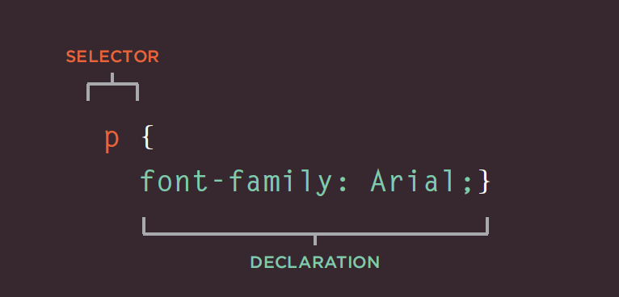
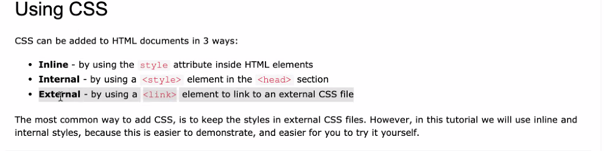
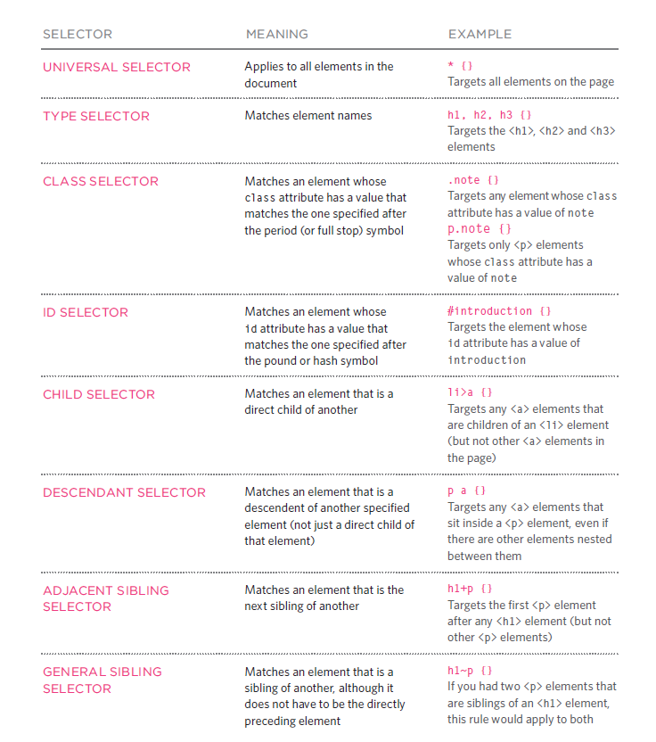

# **Introduction for CSS**

CSS is language for describing the presentation of web pages, including colors, layout, and fonts. It allows one to adapt the presentation to different types of devices, such as large screens, small screens.

## **CSS Associates Style rules with HTML elements**

;

* selectors: specify the elements the rule applies to.

* declarations: that indicate what these elements should look like. which includes the the properties of the element that you want to change, and the values of those properties.



**Note:** CSS Saves a Lot of Work!,the style definitions are normally saved in external .css files.
With an external stylesheet file, you can change the look of an entire website by changing just one file!

## **CSS Selectors:**



## **Color In CSS:**

CSS allows us to change each element color or the text color by using the proper command. You can specify any color of the text inside an element in three ways :

* Color Names:

```
h1 {color: DarkCyan;
```
* Hex Codes:

```
h2 {color: #ee3e80;}
```

* rgb Values:
```
p {color: rgb(100,100,90);}
```
